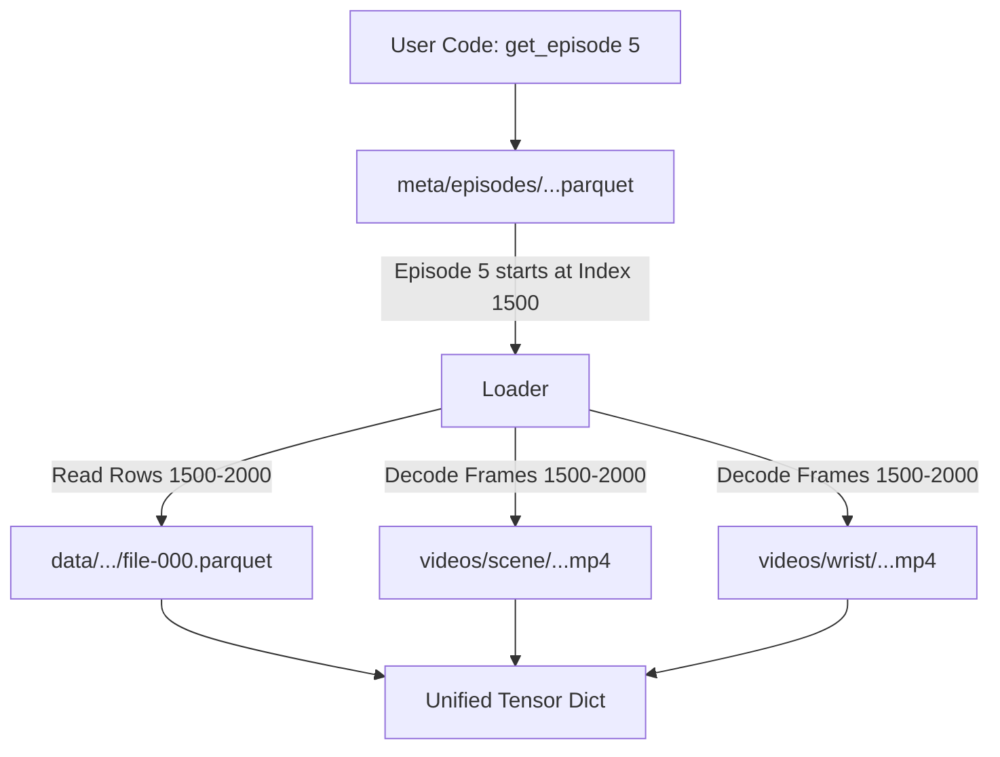

This file structure represents the **LeRobot Dataset v2.0** format. It is designed to act like a synchronized movie editor's timeline, separating "heavy" visual data from "light" numeric data while keeping them perfectly aligned.

Here is how to connect the dots between these files:

### 1. The "Backbone" vs. The "Eyes"

The most critical connection is between `data/` and `videos/`. They are **index-aligned**.

* **`data/chunk-000/file-000.parquet`**: This is the **Master Timeline**. It contains the "light" data for every single time step (e.g., 30Hz), such as:
* `action` (motor commands)
* `observation.state` (joint positions)
* `timestamp`

* **`videos/.../file-000.mp4`**: These are the compressed visual feeds.
* **The Connection:** Row **#100** in the `data` Parquet file corresponds exactly to Frame **#100** in the `videos` MP4 file.
* **Why split them?** If you just want to calculate the average velocity of the robot arm, you read the small Parquet file (fast). If you want to train a Vision Transformer, you decode the MP4 (heavy).

### 2. The "Chapter Markers" (`meta/episodes`)

If you just read the `data` folder, you would see one continuous, infinite stream of robot movement. You wouldn't know when the robot finished a task and reset to the beginning.

* **`meta/episodes/chunk-000/file-000.parquet`**: This file acts as the **Index / Table of Contents**. It contains columns typically like:
* `episode_index`: The ID of the attempt (e.g., Try #1, Try #2).
* `index`: The **start row** in the main `data` file where this episode begins.
* `length`: How many frames this episode lasts.

* **How it works:** When you ask for `dataset[0]` (Episode 1), the loader looks here first, finds that Episode 1 starts at Row 0 and ends at Row 500. It then fetches only those rows from `data`.

### 3. The "Instruction Manual" (`meta/info.json` & `stats.json`)

These files are critical for the **Robot Foundation Models** (like ACT or Diffusion Policy) you are interested in.

* **`meta/stats.json`**: This contains the **Pre-computed Normalization Statistics** (Mean and Standard Deviation) for every dimension of your data.
* *Why it matters:* Diffusion Policy and ACT require data to be normalized (usually to Gaussian or [-1, 1]). LeRobot pre-calculates this so you don't have to iterate through terabytes of data every time you start training.

* **`meta/info.json`**: The configuration file. It tells the code:
* The FPS (e.g., 30).
* The structure of the features (e.g., "The `action` column has 6 dimensions").

### Summary Diagram

Here is the conceptual flow of how a dataloader reads this structure:

### Why this matters for your research

Since you are interested in **ACT vs Diffusion Policy**:

1. **ACT** needs chunking (predicting  steps into the future). This file format allows the dataloader to instantly grab "current frame + next 50 frames" from the Parquet file without seeking through a messy ROS bag.
2. **Multiprocessing:** Because the videos are separate files, your CPU can decode MP4 frames in parallel while your GPU processes the previous batch, maximizing training throughput.